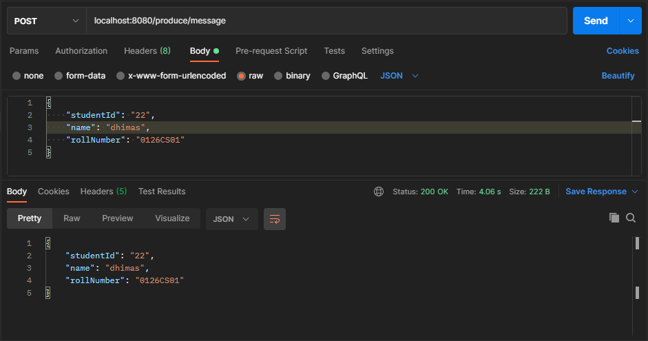
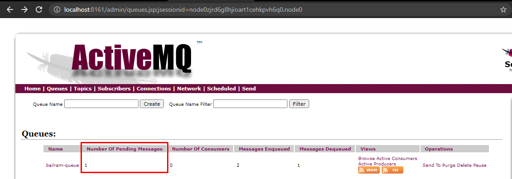
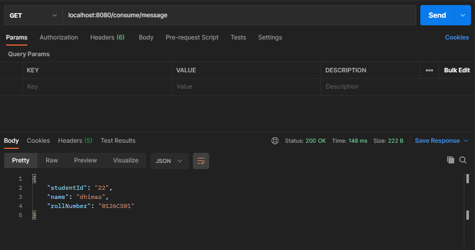
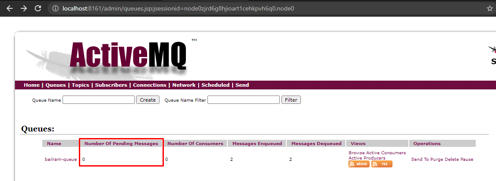

# Spring Boot Message Broker Using ActiveMQ
Trying to send message through POST localhost:8080/produce/message  

As you can see the message will be save in the ActiveMQ queue  

We going to get the message by accessing GET localhost:8080/consume/message  

And then the value number of pending messages in ActiveMQ will be change to zero  
